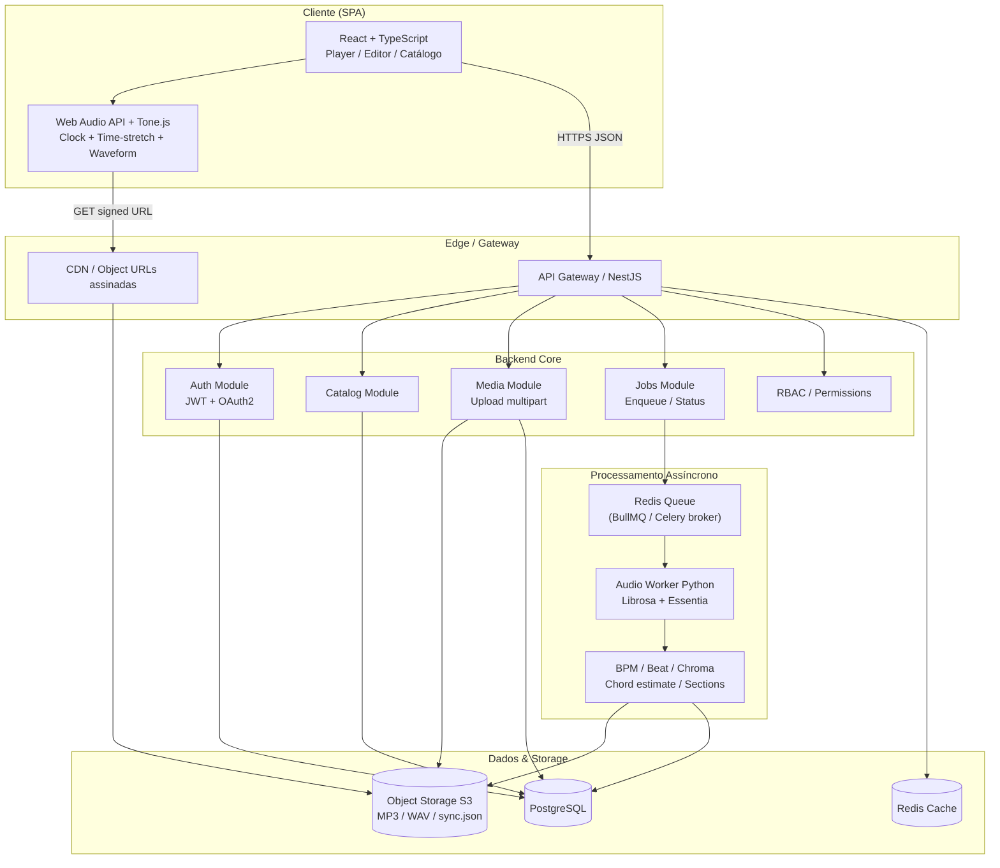
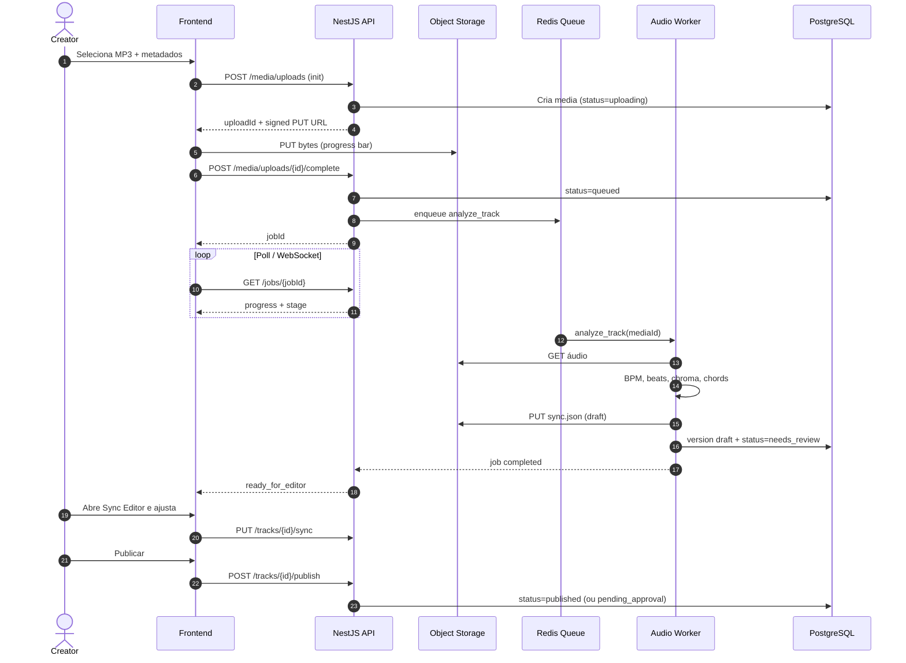
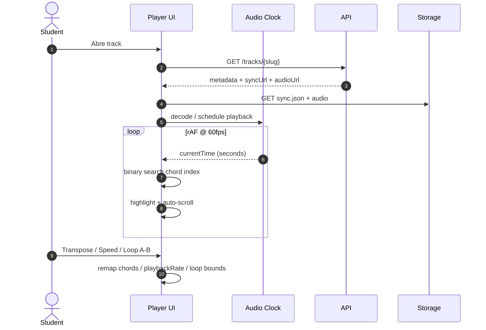
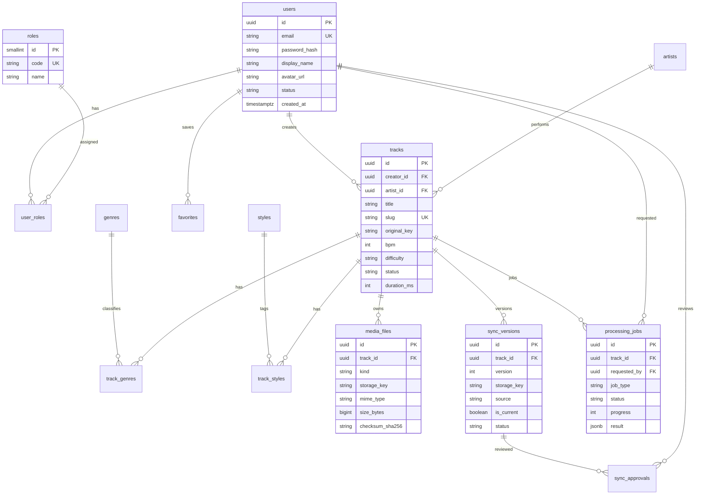
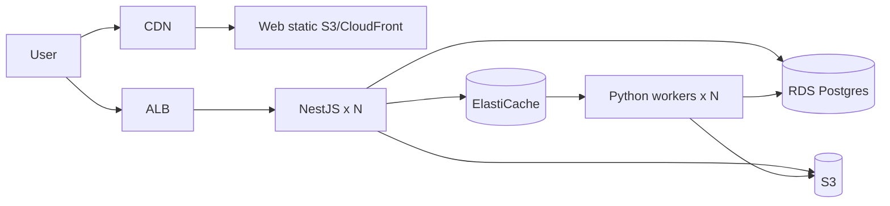
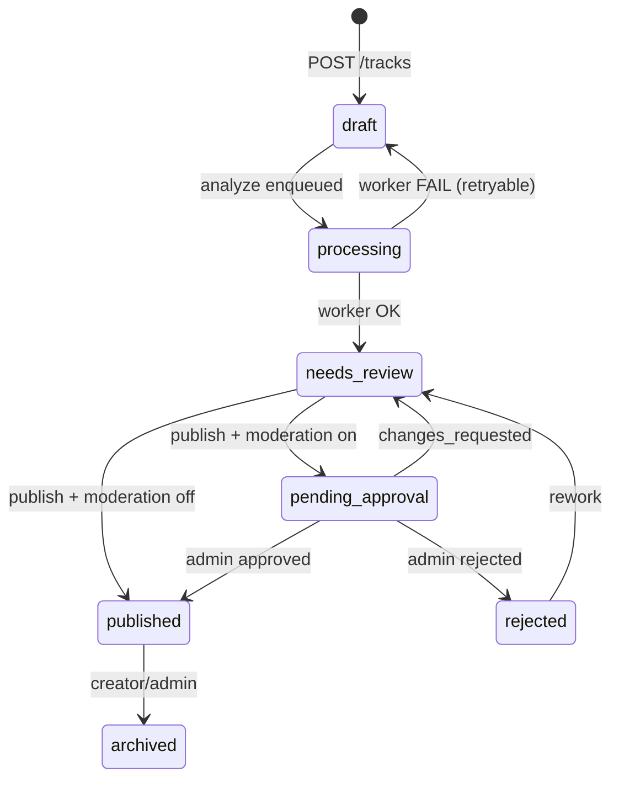

# CifraTrack — Spec Document (SDD)

| Campo | Valor |
|-------|-------|
| **Produto** | CifraTrack |
| **Versão do Spec** | 1.0.0 |
| **Status** | Draft aprovado para implementação |
| **Data** | 2026-07-31 |
| **Metodologia** | Spec-Driven Development (SDD) |
| **Audiência** | Engenharia, Produto, Design, QA |

> Este documento é a **fonte da verdade** do produto. Implementação, testes e PRs devem referenciar IDs de requisitos (`RF-*`, `RNF-*`, `API-*`, `DF-*`). Alterações de escopo exigem revisão deste Spec.

---

## Sumário

1. [System Overview & Architecture Diagram](#1-system-overview--architecture-diagram)
2. [Data Models & Database Schema](#2-data-models--database-schema)
3. [API Contracts](#3-api-contracts)
4. [Data Format Especificador (JSON de Sincronização)](#4-data-format-especificador-json-de-sincronização-de-cifra)
5. [Component Breakdown (Frontend UI Tree)](#5-component-breakdown-frontend-ui-tree)
6. [Plano de Implementação Passo a Passo](#6-plano-de-implementação-passo-a-passo)
7. [Stack Tecnológica (Justificativa)](#7-stack-tecnológica-justificativa-arquitetural)
8. [Requisitos Funcionais por Módulo](#8-requisitos-funcionais-por-módulo)
9. [Diretrizes de UI/UX](#9-diretrizes-de-uiux)
10. [Requisitos Não Funcionais](#10-requisitos-não-funcionais)
11. [Glossário & Decisões Abertas](#11-glossário--decisões-abertas)

---

## 1. System Overview & Architecture Diagram

### 1.1 Visão do Produto

**CifraTrack** é uma plataforma web para músicos **estudarem, praticarem e tocarem junto** com faixas de áudio. O valor central é a **sincronização perfeita** entre áudio, cifra e posição temporal (play-along guiado).

Pilares do produto:

| Pilar | Descrição |
|-------|-----------|
| **Backing Track / Playback Cifrado** | Reprodução de áudio com rolagem visual da cifra sincronizada |
| **Play-Along Interativo** | Destaque em tempo real do acorde/tempo enquanto a música toca |
| **Conversor MP3 → Cifra Sincronizada** | Ingestão de MP3, análise de áudio e geração de estrutura cifrada com timestamps |

### 1.2 Objetivos de Negócio (OKRs de produto)

- Reduzir o tempo entre “subir um MP3” e “praticar com cifra sincronizada” para **< 10 min** (fluxo feliz, faixa ≤ 5 min).
- Garantir latência de sync visual ≤ **40 ms** em relação ao clock de áudio no player (desktop).
- Permitir prática eficiente: loop A/B, time-stretch sem mudança de pitch, transposição de tom.

### 1.3 Atores e Perfis (RBAC)

| Role | Código | Capacidades principais |
|------|--------|------------------------|
| Administrador | `admin` | Gestão total, aprovação de mídias/cifras, métricas, moderação |
| Criador / Músico | `creator` | Upload MP3, disparar conversão, editar sync, publicar |
| Estudante / Usuário Final | `student` | Catálogo, player, transposição, favoritos |

### 1.4 Diagrama de Arquitetura (alto nível)



### 1.5 Diagrama de Sequência — Conversão MP3 → Cifra



### 1.6 Diagrama de Sequência — Play-Along



### 1.7 Bounded Contexts

| Contexto | Responsabilidade |
|----------|------------------|
| **Identity** | Usuários, auth, roles, sessões |
| **Catalog** | Artistas, tracks, gêneros, busca |
| **Ingestion** | Upload, jobs, worker de áudio |
| **Sync Editor** | Versões de sync, revisão, publish |
| **Playback** | Consumo de sync + áudio (cliente-first) |
| **Moderation** | Aprovação admin, denúncias, métricas |

---

## 2. Data Models & Database Schema

### 2.1 ERD (Mermaid)



### 2.2 Enums de domínio

```text
user_status        = active | suspended | deleted
track_status       = draft | processing | needs_review | pending_approval | published | rejected | archived
difficulty         = beginner | intermediate | advanced
media_kind         = source_audio | preview_audio | waveform_peaks | cover_image
sync_source        = auto | manual | hybrid
sync_status        = draft | published | superseded
job_type           = analyze_audio | regenerate_sync | normalize_audio
job_status         = queued | running | completed | failed | cancelled
approval_decision  = approved | rejected | changes_requested
```

### 2.3 Schema SQL (PostgreSQL) — referência

> Arquivo canônico: [`schema.sql`](./schema.sql)

Princípios:

- UUIDs (`gen_random_uuid()`) como PK.
- Soft-delete via `deleted_at` onde fizer sentido.
- Índices GIN para busca full-text (`title`, `artist.name`).
- `sync` pesado fica no Object Storage; DB guarda ponteiros + metadados indexáveis.
- JSONB apenas para payloads de job/erros/métricas leves — **não** para o sync completo publicado.

### 2.4 Modelo lógico das entidades principais

#### User
| Campo | Tipo | Notas |
|-------|------|-------|
| id | UUID | PK |
| email | CITEXT | único |
| password_hash | TEXT | null se OAuth-only |
| display_name | VARCHAR(80) | |
| oauth_provider | VARCHAR(32) | google, github, null |
| oauth_subject | VARCHAR(255) | |

#### Track
| Campo | Tipo | Notas |
|-------|------|-------|
| id | UUID | PK |
| title | VARCHAR(200) | |
| slug | VARCHAR(220) | único, SEO |
| original_key | VARCHAR(8) | ex: `Am`, `F#` |
| bpm | INT | detectado ou informado |
| time_signature | VARCHAR(8) | default `4/4` |
| difficulty | ENUM | |
| status | ENUM | máquina de estados |
| duration_ms | INT | |

#### SyncVersion
| Campo | Tipo | Notas |
|-------|------|-------|
| version | INT | monotônico por track |
| storage_key | TEXT | `sync/{trackId}/v{n}.json` |
| source | ENUM | auto/manual/hybrid |
| is_current | BOOL | apenas uma current publicada |
| checksum | CHAR(64) | integridade |

---

## 3. API Contracts

**Base URL:** `https://api.cifratrack.app/v1`  
**Auth:** `Authorization: Bearer <access_token>`  
**Content-Type:** `application/json` (exceto upload multipart/signed PUT)

### 3.1 Convenções

- Erros no formato RFC 7807-like:

```json
{
  "type": "https://cifratrack.app/errors/validation",
  "title": "Validation Error",
  "status": 422,
  "detail": "bpm must be between 40 and 240",
  "errors": [{ "field": "bpm", "message": "out of range" }]
}
```

- Paginação: `?page=1&pageSize=20` → `{ items, page, pageSize, total }`.
- IDs: UUID v4.
- Timestamps: ISO-8601 UTC.

### 3.2 Auth — `API-AUTH`

#### `POST /auth/register`

**Request**
```json
{
  "email": "musico@example.com",
  "password": "Str0ng!Pass",
  "displayName": "Ana Silva"
}
```

**Response `201`**
```json
{
  "user": {
    "id": "8f2c0a1e-6b2a-4c9d-9c1e-1a2b3c4d5e6f",
    "email": "musico@example.com",
    "displayName": "Ana Silva",
    "roles": ["student"]
  },
  "accessToken": "<jwt>",
  "refreshToken": "<opaque>",
  "expiresIn": 900
}
```

#### `POST /auth/login`

**Request**
```json
{
  "email": "musico@example.com",
  "password": "Str0ng!Pass"
}
```

**Response `200`:** mesmo shape de register.

#### `POST /auth/refresh`

**Request**
```json
{ "refreshToken": "<opaque>" }
```

#### `POST /auth/forgot-password` / `POST /auth/reset-password`

Fluxo com token de uso único (TTL 30 min) enviado por e-mail.

#### `GET /auth/oauth/{provider}/start` → redirect  
#### `GET /auth/oauth/{provider}/callback`

Providers iniciais: `google`.

### 3.3 Users & RBAC — `API-USER`

#### `GET /me`
Retorna perfil + roles.

#### `PATCH /me`
Atualiza `displayName`, `avatarUrl`.

#### `GET /admin/users` *(admin)*
Lista usuários com filtros.

#### `PATCH /admin/users/{id}/roles` *(admin)*

**Request**
```json
{ "roles": ["creator", "student"] }
```

### 3.4 Catálogo — `API-CAT`

#### `GET /tracks`

Query params:

| Param | Tipo | Descrição |
|-------|------|-----------|
| q | string | busca textual |
| genre | string[] | slug de gênero |
| style | string[] | acoustic, electric, playalong, backing_track |
| key | string | tom (ex: `C`, `Am`) |
| bpmMin / bpmMax | int | faixa |
| difficulty | enum | |
| artist | string | |
| sort | enum | `relevance`, `newest`, `bpm`, `title` |
| page / pageSize | int | |

**Response `200`**
```json
{
  "items": [
    {
      "id": "a1b2c3d4-e5f6-7890-abcd-ef1234567890",
      "slug": "meu-amor-acoustic-playalong",
      "title": "Meu Amor",
      "artist": { "id": "...", "name": "Banda Exemplo" },
      "genres": ["mpb", "pop"],
      "styles": ["acoustic", "playalong"],
      "originalKey": "G",
      "bpm": 92,
      "difficulty": "intermediate",
      "durationMs": 214000,
      "coverUrl": "https://cdn.../cover.jpg"
    }
  ],
  "page": 1,
  "pageSize": 20,
  "total": 128
}
```

#### `GET /tracks/{slug}`

**Response `200`**
```json
{
  "id": "...",
  "slug": "meu-amor-acoustic-playalong",
  "title": "Meu Amor",
  "artist": { "id": "...", "name": "Banda Exemplo" },
  "originalKey": "G",
  "bpm": 92,
  "timeSignature": "4/4",
  "difficulty": "intermediate",
  "durationMs": 214000,
  "genres": ["mpb"],
  "styles": ["acoustic", "playalong"],
  "audio": {
    "url": "https://cdn.../signed-audio",
    "mimeType": "audio/mpeg",
    "expiresAt": "2026-07-31T22:00:00Z"
  },
  "sync": {
    "version": 3,
    "url": "https://cdn.../signed-sync.json",
    "formatVersion": "1.0.0"
  },
  "chordInstrumentDefault": "guitar"
}
```

#### `POST /tracks` *(creator)*

Cria draft de track + metadados iniciais (antes ou após upload).

**Request**
```json
{
  "title": "Meu Amor",
  "artistName": "Banda Exemplo",
  "genres": ["mpb"],
  "styles": ["acoustic", "playalong"],
  "difficulty": "intermediate",
  "originalKey": "G",
  "lyricsPlain": "opcional letra bruta..."
}
```

### 3.5 Media Upload — `API-MEDIA`

#### `POST /media/uploads` *(creator)*

**Request**
```json
{
  "trackId": "a1b2c3d4-e5f6-7890-abcd-ef1234567890",
  "filename": "meu-amor.mp3",
  "mimeType": "audio/mpeg",
  "sizeBytes": 5242880,
  "checksumSha256": "abc..."
}
```

**Response `201`**
```json
{
  "uploadId": "u-...",
  "mediaFileId": "m-...",
  "method": "PUT",
  "uploadUrl": "https://s3.../presigned",
  "headers": { "Content-Type": "audio/mpeg" },
  "expiresAt": "2026-07-31T21:15:00Z"
}
```

#### `POST /media/uploads/{uploadId}/complete`

Confirma upload e enfileira análise (opcional `autoAnalyze: true`).

### 3.6 Jobs / Pipeline — `API-JOB`

#### `POST /tracks/{id}/analyze` *(creator)*

**Request**
```json
{
  "options": {
    "detectBpm": true,
    "detectKey": true,
    "detectChords": true,
    "alignLyrics": true
  }
}
```

**Response `202`**
```json
{
  "jobId": "j-...",
  "status": "queued",
  "trackId": "..."
}
```

#### `GET /jobs/{jobId}`

```json
{
  "jobId": "j-...",
  "status": "running",
  "progress": 62,
  "stage": "chord_estimation",
  "etaSeconds": 40,
  "error": null
}
```

Estágios: `normalize` → `beat_track` → `key_detect` → `chord_estimation` → `lyric_align` → `persist`.

### 3.7 Sync Editor — `API-SYNC`

#### `GET /tracks/{id}/sync` *(creator/owner ou admin)*
Retorna sync atual (draft) inline ou URL assinada.

#### `PUT /tracks/{id}/sync` *(creator)*

**Request:** corpo conforme [§4](#4-data-format-especificador-json-de-sincronização-de-cifra) (`CifraSyncDocument`).

**Response `200`**
```json
{
  "trackId": "...",
  "version": 4,
  "status": "draft",
  "checksum": "..."
}
```

#### `POST /tracks/{id}/publish` *(creator)*

```json
{
  "syncVersion": 4,
  "changelog": "Ajustes no refrão"
}
```

Regra: se política de moderação ativa → `pending_approval`; senão → `published`.

#### `POST /admin/tracks/{id}/approvals` *(admin)*

```json
{
  "decision": "approved",
  "notes": "OK para catálogo"
}
```

### 3.8 Favoritos — `API-FAV`

#### `GET /me/favorites`
#### `PUT /me/favorites/{trackId}`
#### `DELETE /me/favorites/{trackId}`

### 3.9 Admin Metrics — `API-ADM`

#### `GET /admin/metrics/overview`

```json
{
  "usersTotal": 12040,
  "tracksPublished": 890,
  "jobsLast24h": { "completed": 120, "failed": 7 },
  "avgAnalyzeSeconds": 48.2
}
```

---

## 4. Data Format Especificador (JSON de Sincronização de Cifra)

**ID:** `DF-SYNC-1.0.0`  
**JSON Schema canônico:** [`sync-format.schema.json`](./sync-format.schema.json)

### 4.1 Objetivos do formato

- Ser **determinístico** para o player (clock → índice de evento).
- Suportar **transposição** sem reprocessar áudio (acordes como pitch-class + qualidade).
- Suportar **time-stretch** (timestamps em segundos de áudio source; player remapeia).
- Permitir **letra** alinhada e **seções** (intro, verse, chorus).
- Versionável (`formatVersion`).

### 4.2 Documento raiz — `CifraSyncDocument`

```json
{
  "formatVersion": "1.0.0",
  "track": {
    "title": "Meu Amor",
    "artist": "Banda Exemplo",
    "originalKey": "G",
    "bpm": 92,
    "timeSignature": "4/4",
    "durationSec": 214.32,
    "tuning": ["E", "A", "D", "G", "B", "E"]
  },
  "meta": {
    "source": "hybrid",
    "generatedAt": "2026-07-31T18:00:00Z",
    "generator": "cifratrack-worker/0.1.0",
    "confidence": {
      "bpm": 0.94,
      "key": 0.81,
      "chordsAvg": 0.72
    }
  },
  "sections": [
    { "id": "s1", "name": "Intro", "startSec": 0.0, "endSec": 8.7 },
    { "id": "s2", "name": "Verse", "startSec": 8.7, "endSec": 40.2 },
    { "id": "s3", "name": "Chorus", "startSec": 40.2, "endSec": 72.0 }
  ],
  "beats": [
    { "t": 0.0, "beat": 1, "bar": 1 },
    { "t": 0.652, "beat": 2, "bar": 1 }
  ],
  "events": [
    {
      "id": "e1",
      "t": 0.0,
      "tEnd": 1.96,
      "chord": {
        "symbol": "G",
        "root": "G",
        "quality": "maj",
        "bass": null,
        "extensions": []
      },
      "lyricLine": null,
      "sectionId": "s1"
    },
    {
      "id": "e2",
      "t": 12.5,
      "tEnd": 14.1,
      "chord": {
        "symbol": "Cmaj7",
        "root": "C",
        "quality": "maj7",
        "bass": null,
        "extensions": ["maj7"]
      },
      "lyricLine": "Sob a luz da manhã",
      "sectionId": "s2"
    }
  ],
  "lyrics": [
    {
      "id": "l1",
      "t": 12.5,
      "tEnd": 16.0,
      "text": "Sob a luz da manhã",
      "sectionId": "s2"
    }
  ]
}
```

### 4.3 Regras de validação (normativas)

| ID | Regra |
|----|-------|
| DF-R1 | `events` **deve** estar ordenado por `t` ascendente |
| DF-R2 | `tEnd` (se presente) ≥ `t`; se omitido, player usa `t` do próximo evento |
| DF-R3 | `0 ≤ t < durationSec` |
| DF-R4 | `chord.symbol` deve ser reconstruível a partir de `root` + `quality` + `bass` |
| DF-R5 | Transposição opera em `root`/`bass` (pitch-class); `quality` permanece |
| DF-R6 | Time-stretch: timestamps referem-se ao áudio **source** (rate=1.0) |
| DF-R7 | `beats` opcional; se ausente, player deriva grid por BPM + timeSignature |
| DF-R8 | Tamanho máximo recomendado do JSON: **2 MB** |

### 4.4 Algoritmo de resolução no player

```text
function currentEventIndex(t, events):
  // binary search: maior i tal que events[i].t <= t
  // highlight events[i] até events[i+1].t (ou tEnd)

function transpose(chord, semitones):
  chord.root = pitchClassShift(chord.root, semitones)
  if chord.bass: chord.bass = pitchClassShift(chord.bass, semitones)
  chord.symbol = renderSymbol(chord)
```

### 4.5 Exemplo mínimo (smoke test)

```json
{
  "formatVersion": "1.0.0",
  "track": {
    "title": "Demo",
    "artist": "CifraTrack",
    "originalKey": "C",
    "bpm": 100,
    "timeSignature": "4/4",
    "durationSec": 8.0
  },
  "meta": { "source": "manual", "generatedAt": "2026-07-31T00:00:00Z" },
  "sections": [],
  "events": [
    { "id": "e1", "t": 0.0, "chord": { "symbol": "C", "root": "C", "quality": "maj" } },
    { "id": "e2", "t": 2.0, "chord": { "symbol": "G", "root": "G", "quality": "maj" } },
    { "id": "e3", "t": 4.0, "chord": { "symbol": "Am", "root": "A", "quality": "min" } },
    { "id": "e4", "t": 6.0, "chord": { "symbol": "F", "root": "F", "quality": "maj" } }
  ]
}
```

---

## 5. Component Breakdown (Frontend UI Tree)

### 5.1 Árvore de rotas / UI

```text
AppShell
├── AuthGate
│   ├── LoginPage
│   ├── RegisterPage
│   ├── ForgotPasswordPage
│   └── OAuthCallbackPage
├── PublicLayout
│   ├── TopNav (Logo, Search, Theme, UserMenu)
│   ├── HomePage
│   │   ├── HeroBrowse
│   │   ├── GenreRail
│   │   └── FeaturedTracks
│   ├── CatalogPage
│   │   ├── SearchBar
│   │   ├── FilterPanel (key, bpm, genre, style, difficulty)
│   │   └── TrackGrid / TrackList
│   ├── TrackDetailPage
│   │   ├── TrackHeader
│   │   ├── MetaChips
│   │   └── OpenPlayerCTA
│   └── FavoritesPage
├── PlayerLayout (fullscreen, distraction-free)
│   └── InteractivePlayer
│       ├── TransportBar
│       │   ├── PlayPauseButton
│       │   ├── SeekBar + WaveformCanvas
│       │   ├── TimeDisplay
│       │   ├── SpeedControl (time-stretch)
│       │   ├── TransposeControl
│       │   ├── LoopABControl
│       │   └── VolumeControl
│       ├── ChordScrollViewport
│       │   ├── SectionMarkers
│       │   ├── ChordLine / ChordEvent
│       │   ├── LyricLine
│       │   └── ActiveChordHighlight (60fps)
│       ├── ChordDiagramPanel (guitar | ukulele | piano)
│       └── PracticeHUD (BPM efetivo, tom atual, seção)
├── CreatorLayout
│   ├── CreatorDashboard
│   ├── UploadWizard
│   │   ├── FileDropzone
│   │   ├── UploadProgress
│   │   └── MetadataForm
│   ├── JobProgressView
│   └── SyncEditorPage
│       ├── AudioTransportMini
│       ├── WaveformWithMarkers
│       ├── EventTimeline (drag adjust t)
│       ├── ChordInspector
│       ├── LyricsAlignPanel
│       └── PublishBar
└── AdminLayout
    ├── AdminDashboard (metrics)
    ├── ApprovalQueue
    ├── UserManagement
    └── JobMonitoring
```

### 5.2 Pacotes / camadas frontend

```text
apps/web/
  src/
    app/                 # rotas, providers
    features/
      auth/
      catalog/
      player/            # clock, sync resolver, transpose, loop
      sync-editor/
      upload/
      admin/
    shared/
      ui/                # design system tokens
      api/               # client HTTP
      lib/audio/         # Web Audio / Tone.js wrappers
      lib/chords/        # parse/render/transpose
    styles/
```

### 5.3 Contratos de estado do Player (Zustand store — especificação)

```ts
type PlayerState = {
  trackId: string | null;
  status: 'idle' | 'loading' | 'ready' | 'playing' | 'paused';
  currentTime: number;       // segundos source
  duration: number;
  playbackRate: number;      // 0.5 .. 1.5
  transposeSemitones: number; // -6 .. +6
  loop: { enabled: boolean; a: number | null; b: number | null };
  activeEventId: string | null;
  syncDoc: CifraSyncDocument | null;
};
```

### 5.4 Performance budget (UI)

| Métrica | Alvo |
|---------|------|
| Scroll/highlight frame time | ≤ 16.6 ms (60 fps) |
| Drift clock vs audio | ≤ 40 ms |
| TTI do Player com track cached | ≤ 2.5 s (desktop mid) |
| Bundle inicial (gzip) | ≤ 250 KB JS crítico |

Técnicas obrigatórias: `requestAnimationFrame`, binary search em eventos, virtualização de linhas longas, offload de waveform peaks pré-computados, evitar layout thrashing no highlight.

---

## 6. Plano de Implementação Passo a Passo

### Fase 0 — Fundação (1–2 sprints)
- [x] Spec Document SDD (este arquivo)
- [x] Monorepo (pnpm/turborepo): `apps/web`, `apps/api`, `services/audio-worker`
- [x] Docker Compose: PostgreSQL, Redis, MinIO
- [x] CI básica (lint, typecheck, unit)
- [x] Design tokens dark mode + layout shell

**Saída:** ambiente local bootável.

### Fase 1 — Identity & RBAC (1 sprint)
- [x] Register / Login / Refresh / Forgot password
- [ ] OAuth Google *(endpoint stub 501 — ativar com GOOGLE_CLIENT_ID/SECRET)*
- [x] Roles `admin | creator | student`
- [x] Guards na API + menus condicionais no front

**Saída:** `RF-A*` atendidos; seeds de admin.

### Fase 2 — Catálogo & Storage (1–2 sprints)
- [x] CRUD tracks (draft), artistas, gêneros, estilos
- [x] Busca + filtros
- [x] Presigned upload para MinIO/S3
- [x] Favoritos

**Saída:** navegação de catálogo com áudio placeholder.

### Fase 3 — Player Play-Along (2 sprints) — *core value*
- [x] Web Audio / Tone.js transport
- [x] Carregar `CifraSyncDocument` + highlight sync
- [x] Auto-scroll 60fps
- [x] Transpose, speed (time-stretch), Loop A/B
- [x] Chord diagrams básicos
- [x] Fixture tracks manuais (sem worker)

**Saída:** demo interna “praticar com sync perfeito”.

### Fase 4 — Pipeline de Conversão (2–3 sprints)
- [x] Worker Python: BPM, key, chroma/chords
- [x] Geração de sync draft + confidence scores
- [x] Job status API + UI de progresso
- [x] Persistência de versões

**Saída:** upload MP3 → draft editável.

### Fase 5 — Sync Editor (2 sprints)
- [x] Timeline + waveform markers
- [x] Drag adjust de eventos / inserção / remoção
- [x] Alinhamento de letra
- [x] Publish + fluxo de aprovação admin

**Saída:** criadores publicam com qualidade revisada.

### Fase 6 — Hardening & Launch (1–2 sprints)
- [ ] Moderação, métricas admin
- [ ] Observabilidade (OpenTelemetry, Sentry)
- [ ] Testes e2e críticos (auth, upload, player sync)
- [ ] Performance pass + acessibilidade teclado no player
- [ ] Beta fechado

### Critério de Done global (MVP)

1. Student abre track publicada, toca, vê acorde certo no tempo.
2. Creator sobe MP3, recebe draft, ajusta no editor, publica.
3. Admin aprova/rejeita.
4. Transpose e speed funcionam sem regenerar áudio no servidor (pitch-preserving no client).

---

## 7. Stack Tecnológica (Justificativa Arquitetural)

### 7.1 Decisão

| Camada | Escolha | Alternativas avaliadas | Por quê |
|--------|---------|------------------------|---------|
| Frontend | **React 19 + TypeScript + Vite** | Next.js SSR, Vue, Svelte | SPA focada em sessão longa de prática; player é cliente-first; Vite oferece DX e HMR rápidos |
| Estado UI | **Zustand** | Redux, Jotai | Store do player simples, alta frequência de updates sem boilerplate |
| Áudio client | **Web Audio API + Tone.js** (+ SoundTouch/WASM ou `tone` PitchShift / playbackRate com pitch preserve via libs WASM) | Howler-only | Precisão de clock, scheduling e efeitos; Tone.js maduro para música |
| Waveform | **Canvas 2D / peaks pré-computados** (wavesurfer.js opcional no editor) | SVG puro | 60fps estável |
| Backend API | **NestJS (Node 22) + Prisma/Drizzle** | FastAPI monolítico, Spring | Ecossistema TS compartilhado com front; módulos claros; guards RBAC |
| Auth | **JWT access (curto) + refresh opaco** + OAuth2 | Session cookie only | SPA + mobile-ready; refresh rotativo |
| Queue | **BullMQ (Redis)** na API **ou** Celery se worker Python for o único consumidor | SQS puro | Dev local simples; Redis já usado para cache |
| Audio Worker | **Python 3.12 + FastAPI health + Librosa + Essentia (opcional)** | 100% Node (meyda) | Librosa/Essentia são referência em beat/chroma; isolamento de CPU intensivo |
| Chord/AI assist | Pipeline clássico primeiro; **opcional** modelo ML (madmom / BTC / API) na Fase 4.1 | Só IA externa | Controlar custo/latência; fallback determinístico |
| DB | **PostgreSQL 16** | MySQL, Mongo | Relacional + FTS + JSONB pontual |
| Object Storage | **S3 API (MinIO dev / AWS S3 prod)** | FS local | MP3 e sync.json grandes; URLs assinadas |
| Cache | **Redis** | — | Jobs, rate-limit, cache de catálogo |
| Observabilidade | OpenTelemetry + Prometheus + Sentry | — | Jobs longos precisam de tracing |

### 7.2 Diagrama de deploy (alvo)



### 7.3 Trade-offs aceitos

- Detecção automática de acordes **nunca será 100%**; o Sync Editor é parte do produto, não um “plano B”.
- Time-stretch de alta qualidade no browser tem custo de CPU; default rate=1.0; rates extremos podem degradar.
- SSR/SEO limitado no MVP (landing simples); catálogo pode ganhar SSR depois.

---

## 8. Requisitos Funcionais por Módulo

### Módulo A — Gestão de Usuários e RBAC

| ID | Requisito | Prioridade |
|----|-----------|------------|
| RF-A01 | Cadastro com e-mail/senha e validação de e-mail | Must |
| RF-A02 | Login com JWT access + refresh | Must |
| RF-A03 | Recuperação de senha por e-mail | Must |
| RF-A04 | OAuth2 Google | Should |
| RF-A05 | Role Admin: gestão de usuários, aprovações, métricas | Must |
| RF-A06 | Role Creator: upload, analyze, edit sync, publish | Must |
| RF-A07 | Role Student: catálogo, player, transpose, favoritos | Must |
| RF-A08 | Impedir ações cross-role (403) | Must |

### Módulo B — Catálogo & Organização

| ID | Requisito | Prioridade |
|----|-----------|------------|
| RF-B01 | Classificação por gêneros | Must |
| RF-B02 | Estilos/formatos: Acoustic, Electric, Playalong, Backing Track | Must |
| RF-B03 | Busca textual por título/artista | Must |
| RF-B04 | Filtros: tom, BPM, gênero, dificuldade, artista, estilo | Must |
| RF-B05 | Página de detalhe da track com CTA para player | Must |
| RF-B06 | Favoritos por usuário autenticado | Should |

### Módulo C — Pipeline MP3 → Cifra Sincronizada

| ID | Requisito | Prioridade |
|----|-----------|------------|
| RF-C01 | Upload MP3 com progresso (presigned) | Must |
| RF-C02 | Detecção de BPM e grid de beats/compassos | Must |
| RF-C03 | Detecção preliminar de tom e acordes (chroma) | Must |
| RF-C04 | Geração de `CifraSyncDocument` draft | Must |
| RF-C05 | Status de job com progresso/estágio | Must |
| RF-C06 | Editor manual de sincronização (ajuste fino) | Must |
| RF-C07 | Versionamento de sync + publish | Must |
| RF-C08 | Aprovação admin antes do catálogo público (configurável) | Should |
| RF-C09 | Confidence scores expostos no editor | Should |

### Módulo D — Player Interativo

| ID | Requisito | Prioridade |
|----|-----------|------------|
| RF-D01 | Player customizado com Web Audio API | Must |
| RF-D02 | Transposição de tom reescrevendo acordes em tempo real | Must |
| RF-D03 | Time-stretch (velocidade) preservando pitch | Must |
| RF-D04 | Rolagem automática sincronizada + highlight do acorde atual | Must |
| RF-D05 | Loop A/B de trecho | Must |
| RF-D06 | Diagrama de acordes (violão/guitarra; teclado Should) | Must/Should |
| RF-D07 | Seek preciso via waveform/barra | Must |
| RF-D08 | Atalhos de teclado (espaço play/pause, setas seek) | Should |

---

## 9. Diretrizes de UI/UX

### 9.1 Princípios

1. **Dark mode nativo** — estética próxima a Spotify / Ultimate Guitar / Splice: limpa, minimalista, baixa distração.
2. **Player = modo estudo** — tela cheia, alto contraste nos símbolos de acorde (leitura à distância / tablet).
3. **Uma tarefa por tela** no fluxo creator (upload → job → editor → publish).
4. **Feedback temporal** sempre visível (tempo, seção, BPM efetivo).

### 9.2 Tokens (direção visual)

```css
:root {
  --bg-base: #0b0d10;
  --bg-elevated: #14181f;
  --bg-panel: #1a2030;
  --text-primary: #f3f5f7;
  --text-muted: #9aa3b2;
  --accent: #3dde9a;          /* verde-música, não roxo genérico */
  --accent-dim: #1f9d6a;
  --danger: #ff5c5c;
  --chord-active: #3dde9a;
  --chord-idle: #c9d1d9;
  --focus-ring: #5cc8ff;
  --font-sans: "Satoshi", "Geist", system-ui, sans-serif;
  --font-display: "Clash Display", "Satoshi", sans-serif;
  --font-mono: "JetBrains Mono", ui-monospace, monospace;
  --radius-sm: 6px;
  --radius-md: 10px;
}
```

### 9.3 Player UX

- Acordes ativos: escala tipográfica maior + cor `--chord-active` + underline/glow sutil **sem** poluir.
- Auto-scroll com easing leve; usuário pode “pegar” o scroll e pausar auto temporariamente.
- Controles de prática agrupados (transpose / speed / loop) sem esconder play/pause.
- Responsivo: **Desktop + Tablet first**; mobile browse ok, player mobile = fase pós-MVP.

### 9.4 Acessibilidade

- Contraste WCAG AA em textos e acordes.
- Controles focáveis por teclado.
- `aria-live` opcional para anunciar seção (desligável — não atrapalhar prática).

---

## 10. Requisitos Não Funcionais

| ID | Categoria | Requisito |
|----|-----------|-----------|
| RNF-01 | Performance | Highlight sync ≤ 40 ms de drift |
| RNF-02 | Performance | UI player 60 fps em notebook mid-range |
| RNF-03 | Escalabilidade | Workers horizontais; jobs idempotentes |
| RNF-04 | Segurança | Presigned URLs; vírus/tipo MIME validado; rate-limit upload |
| RNF-05 | Segurança | Senhas com Argon2id; JWT curto; refresh rotation |
| RNF-06 | Confiabilidade | Retry com backoff em jobs; dead-letter queue |
| RNF-07 | Legal | Respeitar direitos autorais — ToS: usuário garante direitos do áudio |
| RNF-08 | Observabilidade | Trace id por job; métricas de falha de analyze |
| RNF-09 | Compatibilidade | Chrome/Edge/Firefox latest; Safari desktop Should |
| RNF-10 | Disponibilidade | API MVP 99.5%; player degrada graceful se sync falhar |

---

## 11. Glossário & Decisões Abertas

### Glossário

| Termo | Definição |
|-------|-----------|
| **Sync Document** | JSON `CifraSyncDocument` com eventos tempo→acorde |
| **Play-Along** | Modo de prática com highlight guiado |
| **Time-stretch** | Mudança de duração/BPM sem alterar pitch |
| **Chroma** | Representação de pitch-class usada na estimativa de acordes |
| **Presigned URL** | URL temporária para upload/download direto no S3 |

### ADR / Decisões abertas (para fechar na Fase 0–1)

| ID | Pergunta | Opção preferida | Status |
|----|----------|-----------------|--------|
| ADR-01 | Monorepo tool | pnpm + Turborepo | Proposto |
| ADR-02 | ORM | Prisma | Proposto |
| ADR-03 | Moderação obrigatória | Flag `REQUIRE_APPROVAL=true` | Proposto |
| ADR-04 | Pitch-preserving stretch lib | SoundTouch WASM / Rubber Band WASM | Em avaliação |
| ADR-05 | Alinhamento de letra automático | Manual no MVP; forced-aligner depois | Proposto |
| ADR-06 | Nome definitivo do produto | CifraTrack | Provisório OK |

---

## Apêndice A — Máquina de Estados da Track



---

## Apêndice B — Matriz de Rastreabilidade (amostra)

| Requisito | API | UI | Data |
|-----------|-----|----|------|
| RF-A02 | API-AUTH login | LoginPage | users |
| RF-B04 | API-CAT GET /tracks | FilterPanel | tracks, genres |
| RF-C04 | API-JOB + worker | JobProgressView | sync_versions, S3 |
| RF-D04 | — (client) | ChordScrollViewport | DF-SYNC |

---

*Fim do Spec Document CifraTrack v1.0.0 — qualquer implementação fora deste documento deve gerar PR de atualização do Spec antes ou junto do código.*
